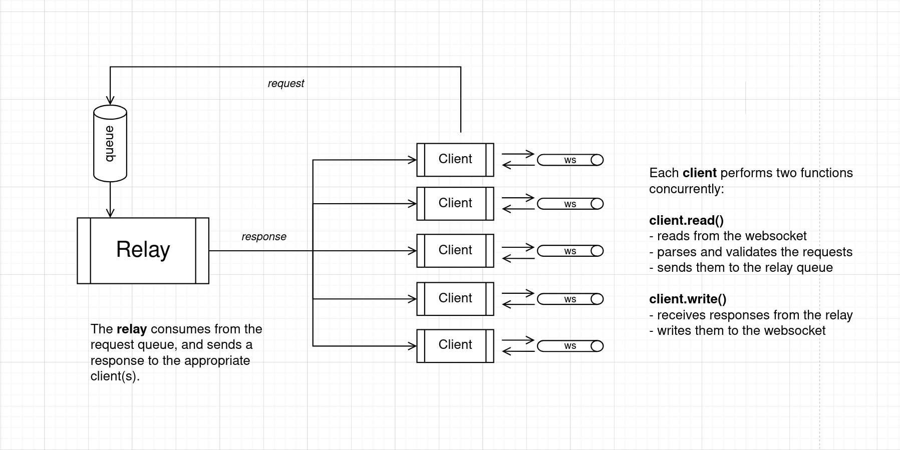

# rely
A framework for building super custom [Nostr](https://github.com/nostr-protocol/nostr) relays you can *rely* on. Written in Go, it's designed to be simple and performant, while providing an exeptional developer experience.

<a href="https://pkg.go.dev/github.com/pippellia-btc/rely"></a>
[](https://goreportcard.com/report/github.com/pippellia-btc/rely)

## Installation
```
go get github.com/pippellia-btc/rely
```

## Simple and Customizable
Getting started is easy, and deep customization is just as straightforward.

```golang
package main

import (
	"context"
	"os/signal"
	"syscall"

	"github.com/pippellia-btc/rely"
)

func main() {
	ctx, cancel := signal.NotifyContext(context.Background(), syscall.SIGINT, syscall.SIGTERM)
	defer cancel()

	relay := rely.NewRelay()

	err := relay.StartAndServe(ctx, "localhost:3334")
	if err != nil {
		panic(err)
	}
}
```

### Structural Customization
Fine-tune core parameters using functional options:

```golang
relay := rely.NewRelay(
    rely.WithDomain("myDomain.com"),	// required for NIP-42 validation
	rely.WithLogger(myLogger),			// configure the relay logger
	rely.WithInfo(myRelayInfo)			// set up nip-11 information document
)
```

To find all the available options and documentation, see [options.go](/options.go).

### Behavioral Customization

You are not limited to simple configuration variables. The relay architecture facilitates complete behavioral customization by allowing you to inject your own functions into its `Hooks`. This gives you full control over the connection lifecycle, event flow and rate-limiting, enabling any custom business logic.

Below is a silly example that illustrates rely's flexibility.

```golang
func main() {
	// ...
	relay.Reject.Connection = append(relay.Reject.Connection, BadIP)
	relay.Reject.Event = append(relay.Reject.Event, RejectSatan)
	relay.On.Event = Save	// your custom DB save
}

func BadIP(s Stats, req *http.Request) error {
	if slices.Contains(blacklist, IP(req)) {
		return fmt.Errorf("you shall not pass!")
	}
	return nil
}

func RejectSatan(client Client, event *nostr.Event) error {
	if event.Kind == 666 {
		blacklist = append(blacklist, client.IP())
		client.Disconnect()
		return errors.New("not today, Satan. Not today")
	}
	return nil
}
```

You can find all the available hooks and documentation, in [hooks.go](/hooks.go).  
If you need additional hooks, don't hesitate to [open an issue](https://github.com/pippellia-btc/rely/issues/new)!

If you are looking for inspiration or examples, check out the [examples](/examples/) directory.

### Intuitive interfaces

If you've read the [NIP-01](https://github.com/nostr-protocol/nips/blob/master/01.md), you already know how to use rely.  
Don't believe it? These three are the only interfaces that you'll have to deal with:

- [Relay](/relay.go)
- [Client](/client.go)
- [Subscription](/subscription.go)

No obscure structures leaking implementation details, just intuitive methods that almost require no explanation. As an example, these are some of the methods of the `Client` interface (all safe for concurrent use).

```golang
type Client interface {
	IP() string
	
	Pubkey() string

	ConnectedAt() time.Time

	Subscriptions() []Subscription

	SendNotice(msg string)

	SendAuth()

	Disconnect()

	// All other methods...
	// (don't fear, there are be comments and docs for all methods)
}
```

## Performant

Rely is completely written in Go, a memory-safe and low level language that is easy to learn and performant. It's particularly fit for building server-side applications thanks to its powerful concurrency primitives like channels and goroutines.

These features are extensively used in rely, creating a lock-free architecture on the hot-paths.  
Inspired by [strfry](https://github.com/hoytech/strfry), rely also implements inverted indexes for matching broadcasted events with subscriptions, making this crucial operation very efficient. For more, check out the [architecture section](#architecture).

All of these optimizations allow a [dummy implementation](https://github.com/pippellia-btc/rely/blob/main/tests/random_test.go) using rely to serve 8000+ concurrent "spammy" clients with less than 1GB of RAM on a 2017 i5 CPU (4-cores).

## Secure by Design

To prevent resource abuse, each client is assigned a fixed-size queue for outgoing messages.  
Before processing each `REQ`, the relay calculates the remaining free space and uses that number as a hard cap for the filters' limits. If the total request exceeds the budget, the larger filters are scaled down proportionally.

Here is an example illustrating it.
``` 
1. client's queue has a free capacity of 300.

2. client sends a REQ with two filters f1 and f2.
	f1: limit=10		f2: no limit

3. the filters' limits are modified to match the free capacity:
	f1: limit=10		f2: limit=290
```

This prevents waste of CPU and bandwidth on events the client will not see, and penalizes clients that request more than they consume. The size of the client's queue can be customized with the appropriate [option](/options.go).

## Architecture



### Client

The Client is the middleman between the websocket connection and the Relay. It reads and writes to the websocket in two separated goroutines, ensuring proper serialization.

**Client.read**:
- reads from the websocket and parses nostr messages
- applies the user defined `Reject` hooks
- sends to the Processor's queue
- handles NIP-42 authentication

**Client.write**:
- receives responses in a dedicated queue
- writes them to the websocket

### Processor

The Processor received incoming requests (REQs, EVENTs, COUNTs), and handles them by applying the user defined `On` hooks (e.g. `On.Event`, `On.Req`, `On.Count`). It consumes from a dedicated queue with a limited but configurable number of worker goroutines.

### Dispatcher

The Dispatcher is responsible for broadcasting newly received events to all matching subscriptions.
To accomplish this task efficiently, it maintains inverted indexes for all active subscriptions of all clients, an approach inspired by [strfry](https://github.com/hoytech/strfry).

However, the Dispatcher is not the ultimate authority on the subscriptions state. Each client is the authority for its own subscriptions, while the dispatcher only maintains an eventually-consistent snapshot of the active ones. This decision is motivated by two reasons:

1. having CLOSEs cancel the subscriptions as fast as possible to save work.
2. making calls to `Client.Subscriptions` very efficiently.

## Well tested

Rely fetures unit tests for components that make sense to test in isolation.
More importantly, we have a [random stress test](https://github.com/pippellia-btc/rely/blob/main/tests/stress_test.go) where the relay is bombarded with thousands of connections, events, filters, and abrupt disconnections every second. This test alone allowed the discovery of hard concurrency bugs and race conditions impossible to detect with simplistic unit tests.

## Used by

This section lists project and repositories that are using rely in production.

- [ContextVM](https://github.com/ContextVM/contextvm-relay)
- [Zapstore](https://github.com/zapstore/relay)
- [Vertex](https://github.com/vertex-lab/relay)

## FAQs

<details>
<summary>Why does On.Req accept multiple filters?</summary>

As per [NIP-01](https://github.com/nostr-protocol/nips/blob/master/01.md), a REQ can contain multiple filters. Returning only one filter (at the time) would prevent the user of rely from implementing custom query optimizations.

You can always loop through the filters and make a query for each.
</details>

<details>
<summary>When NIP-86?</summary>

Does anyone uses NIP-86? If so, please let me know.  
Just so you know, you can embedd the `Relay` inside an http server, where you can configure all the methods you want.

</details>
